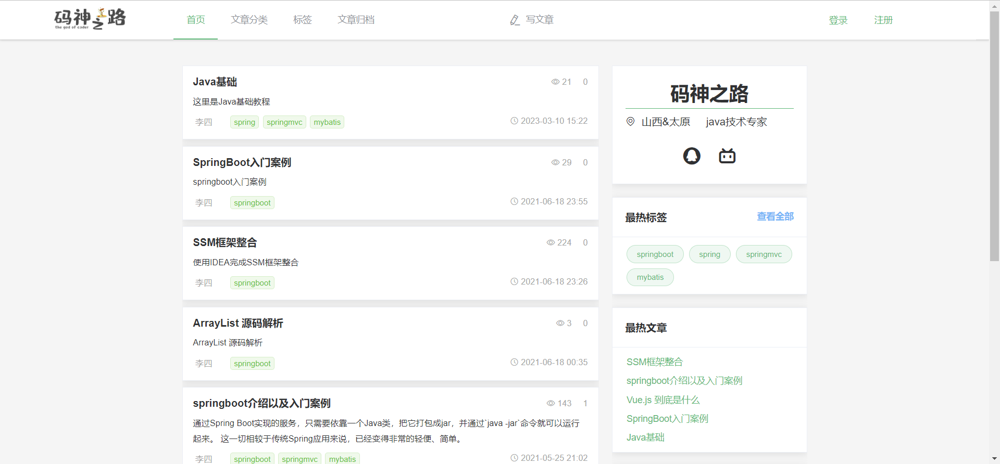
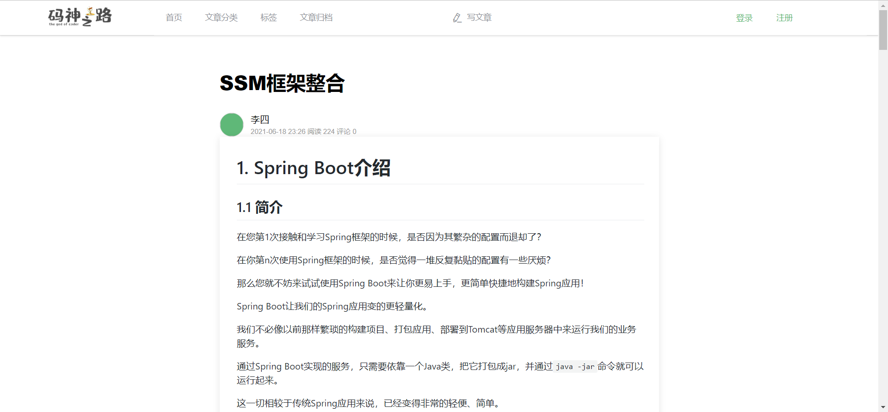
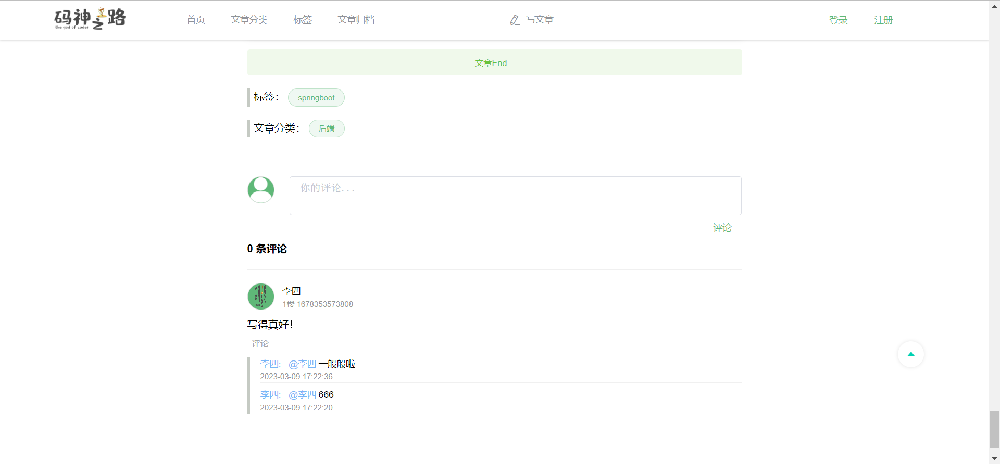
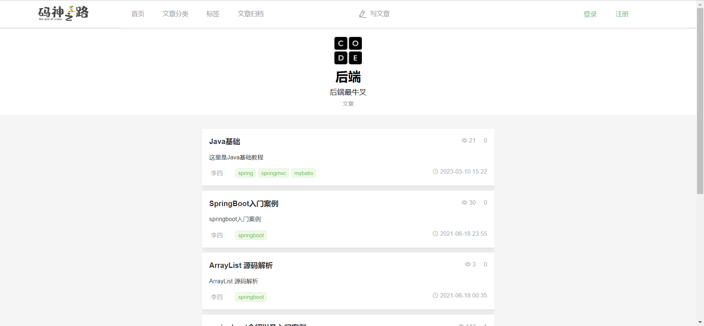
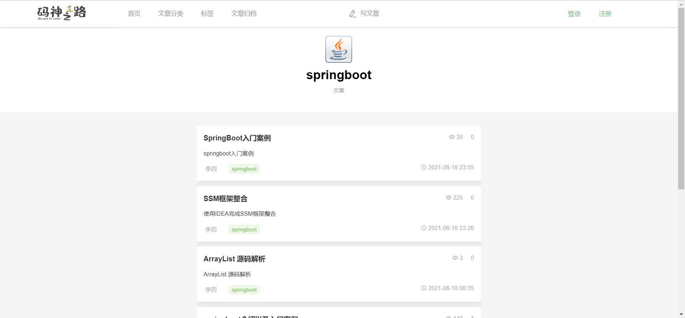
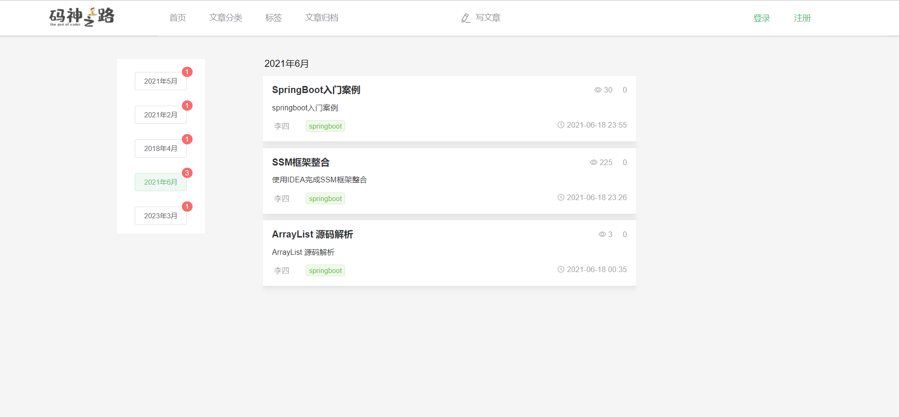
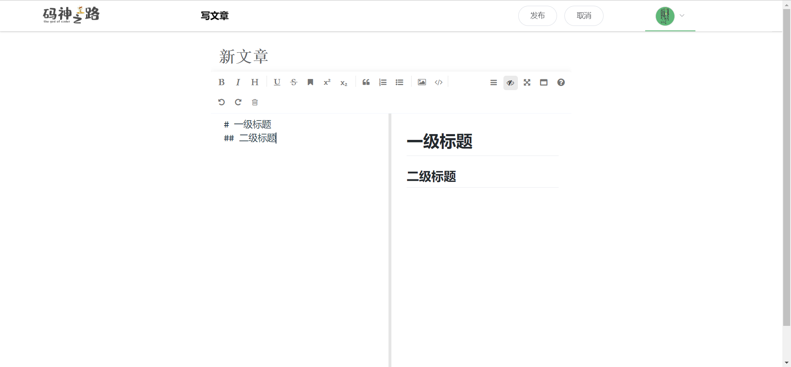

# 工程简介

本项目为基于 SpringBoot + Vue 的前后端分离的个人博客项目。

## 开发环境

- 前端工程：
  - node.js V16.16.0
- 后端工程：
  - JDK1.8
  - MySQL 8.0
  - Redis 6.2.3
- Windows 11

## 前端工程启动说明

进入到blog-app目录并在终端内依次运行以下命令：

~~~ bash
# 安装相关环境依赖
npm install

# 项目构建
npm run build

# 项目启动
npm run start
~~~

## 功能模块

- 首页

  

- 文章详情

  

- 评论功能

  

- 文章分类

  

- 标签

  

- 文章归档

  

- 写文章

  

## 技术亮点

1. jwt + Redis

   token 令牌的登录方式，访问认证速度快，session 共享，安全性

   Redis 做了令牌和用户信息的对应管理，具有以下好处：

   - 进一步增加了安全性
   - 登录用户做了缓存
   - 灵活控制用户的过期（续期，踢掉线等）

2. 使用了 `ThreadLocal` 保存用户信息，请求的线程之内可以随时获取登录用户的信息，做了线程隔离

3. 在使用完`ThreadLocal`之后，做了 value 删除，防止内存泄漏

4. 线程安全 `UPDATE tableName SET value = newValue WHERE id = 1 AND value = oldValue`

5. 使用AOP实现统一日志记录，统一缓存处理

6. 线程池 应用非常广（对当前的主业务流程无影响的操作，放入线程池中执行）